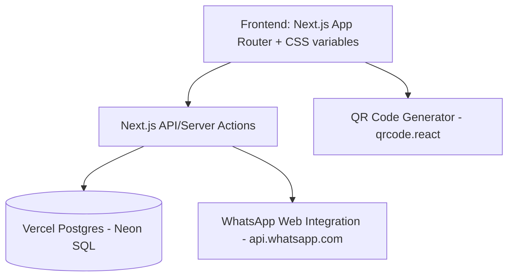

# System Architecture

## Overview
The application is built as a modern, responsive Single Page Application (SPA) using Next.js (App Router, version 16.2.7) with TypeScript and styled with Vanilla CSS. For database storage, it integrates with Vercel Postgres to store leads, appointments, and match configuration.

## Data Schema

### 1. Lead (Müşteri)
Stores customer contact information, requirements, and profiling data.

| Field Name | Type | Description |
| :--- | :--- | :--- |
| `id` | UUID | Primary Key |
| `name` | VARCHAR | Full Name of the client |
| `phone` | VARCHAR | Phone number |
| `email` | VARCHAR | Email address |
| `source` | VARCHAR | Instagram, WhatsApp, Sahibinden, Reference, Walk-in |
| `property_type` | VARCHAR | Apartment, Duplex, Villa, Land, Commercial |
| `room_count` | VARCHAR | 1+1, 2+1, 3+1, 4+2, etc. |
| `purpose` | VARCHAR | Investment (Yatırımlık), Living (Oturumluk), Summer House (Yazlık) |
| `target_region` | VARCHAR | Desired area (e.g. Altınoluk, Akçay) |
| `current_location`| VARCHAR | City/country where the client currently lives (e.g. Istanbul, Germany) |
| `marital_status` | VARCHAR | Single, Married, Married with Kids, etc. |
| `occupation` | VARCHAR | Occupation/Job sector |
| `budget` | DECIMAL | Maximum budget in TL |
| `warmth` | VARCHAR | cold, warm, hot |
| `is_alert_active` | BOOLEAN | Flag to match when prices drop |
| `notes` | TEXT | Special preferences or notes |
| `customer_question`| VARCHAR | Customer's questions/queries |
| `lead_status` | VARCHAR | Current lead status |
| `rejection_reason` | VARCHAR | Reason if lead is lost/rejected |
| `last_update_info` | VARCHAR | Automatically compiled description of updated fields |
| `created_at` | TIMESTAMP | Creation timestamp |
| `updated_at` | TIMESTAMP | Last update timestamp |

### 2. Appointment (Randevu)
Tracks meetings scheduled with clients.

| Field Name | Type | Description |
| :--- | :--- | :--- |
| `id` | UUID | Primary Key |
| `lead_id` | UUID | Foreign Key linking to Lead |
| `date_time` | TIMESTAMP | Appointment date and time |
| `location` | VARCHAR | Meeting location or property details |
| `status` | VARCHAR | Pending, Completed, Cancelled |
| `notes` | TEXT | Appointment-specific notes |
| `appointment_type`| VARCHAR | Meeting type |

### 3. Property (Gayrimenkul)
Simple table to represent available properties for matching.

| Field Name | Type | Description |
| :--- | :--- | :--- |
| `id` | UUID | Primary Key |
| `title` | VARCHAR | Property Title |
| `price` | DECIMAL | Price in TL |
| `region` | VARCHAR | Region |
| `type` | VARCHAR | Type (e.g., Duplex) |
| `room_count` | VARCHAR | 1+1, 2+1, etc. |
| `parsel` | VARCHAR | Parsel number |
| `bag_bol_no` | VARCHAR | Independent section number |
| `kat` | VARCHAR | Floor level |
| `kull_amaci` | VARCHAR | Purpose of use (e.g., Mesken) |
| `kapali_alan` | DECIMAL | Indoor area in sqm |
| `acik_alan` | DECIMAL | Outdoor area in sqm |
| `net_alan` | DECIMAL | Net area in sqm |
| `brut_alan` | DECIMAL | Gross area in sqm |
| `portfoy_adi` | VARCHAR | Portfolio ID/Name |
| `extra_ozellik` | VARCHAR | Additional specs or description |
| `portfoy_kimde` | VARCHAR | Handler info |
| `daire_sahibi` | VARCHAR | Owner details |
| `is_sold` | BOOLEAN | Flag denoting if the property is sold |
| `created_at` | TIMESTAMP | Creation timestamp |

## Modules

### 1. Data Entry & CRM
A dashboard with lead cards categorized by warmth, showing quick action buttons (Call, WhatsApp, Add Appointment).

### 2. Smart Matchmaker
An advanced matching module comparing `Lead` requirements against available properties. Integrates 10% budget flexibility and keyword parsing (e.g. `bahçeli`, `dubleks`), and excludes properties marked as `is_sold` or `portfoy_kimde = 'Kapalı'`. Generates direct WhatsApp shareable links.

### 3. QR Code Generator & Intake
Provides a QR code pointing to a public client intake form `(/public/intake)`. Scanning this opens a mobile-friendly page where new clients can enter their requirements. Once submitted, it saves to the PostgreSQL DB and appears in the CRM.

### 4. Boss Reporting Module (Daily Report)
Compiles stats (new leads, appointments, etc.) into an editable text block. Opens WhatsApp with the formatted report ready to send to the boss.

### 5. Collapsible Raporlama/Info Sidebar Menu
* **Raporlar (General Reports)**: Excel-like inline database table with date filters ("Tüm Zamanlar", "Bugün", "Dün", "Bu Hafta", "Bu Ay", "Tarih Aralığı"), multi-column sorting, search, and 6 visual breakdown charts (Warmth, Sources, Room demand, Purchase purpose, City distribution, Customer questions) excluding blank/unknown responses from percentage calculations.
* **Info (Boss Daily Report)**: WhatsApp reporting template.

### 6. Müşteri Veritabanı
An editable, auto-saving data grid next to the Matchmaker to view and update customer records directly without opening form dialogues.

### 7. Portföy & Daire Yönetimi
Displays active properties with inline editing and a **"Satıldı"** (Sold) checkbox. Properties marked as sold are moved to a separate **"Satılan Daireler"** table at the bottom of the page with faded formatting.
