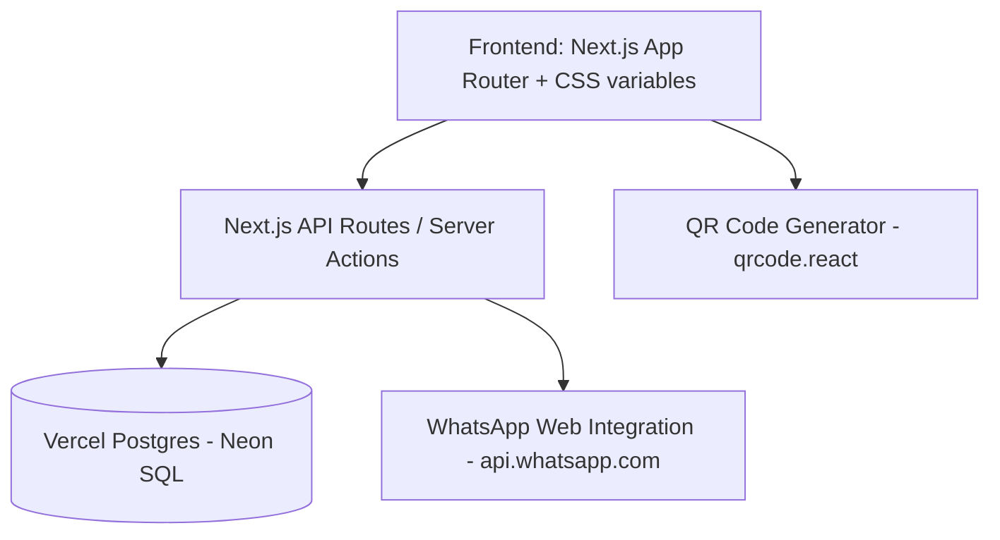

# System Architecture

## Overview
The application is built as a modern, responsive Single Page Application (SPA) using Next.js (App Router) and styled with Vanilla CSS. For database storage, it integrates with Vercel Postgres to store leads, appointments, and match configuration.

## Data Schema

### 1. Lead (Müşteri)
Stores customer contact information, requirements, and profiling data.

| Field Name | Type | Description |
| :--- | :--- | :--- |
| `id` | UUID | Primary Key |
| `name` | VARCHAR | Full Name of the client |
| `phone` | VARCHAR | Phone number |
| `email` | VARCHAR | Email address |
| `source` | VARCHAR | Instagram, WhatsApp, Sahibinden, Reference, Walk-in |
| `property_type` | VARCHAR | Apartment, Duplex, Villa, Land, Commercial |
| `room_count` | VARCHAR | 1+1, 2+1, 3+1, 4+2, etc. |
| `purpose` | VARCHAR | Investment (Yatırımlık), Living (Oturumluk), Summer House (Yazlık) |
| `target_region` | VARCHAR | Desired area (e.g. Altınoluk, Akçay) |
| `current_location`| VARCHAR | City/country where the client currently lives (e.g. Istanbul, Germany) |
| `marital_status` | VARCHAR | Single, Married, Married with Kids, etc. |
| `occupation` | VARCHAR | Occupation/Job sector |
| `budget` | DECIMAL | Maximum budget in TL |
| `warmth` | VARCHAR | cold, warm, hot |
| `is_alert_active` | BOOLEAN | Flag to match when prices drop |
| `notes` | TEXT | Special preferences or notes |
| `created_at` | TIMESTAMP | Creation timestamp |

### 2. Appointment (Randevu)
Tracks meetings scheduled with clients.

| Field Name | Type | Description |
| :--- | :--- | :--- |
| `id` | UUID | Primary Key |
| `lead_id` | UUID | Foreign Key linking to Lead |
| `date_time` | TIMESTAMP | Appointment date and time |
| `location` | VARCHAR | Meeting location or property details |
| `status` | VARCHAR | Pending, Completed, Cancelled |
| `notes` | TEXT | Appointment-specific notes |

### 3. Property (Gayrimenkul)
Simple table to represent available properties for matching.

| Field Name | Type | Description |
| :--- | :--- | :--- |
| `id` | UUID | Primary Key |
| `title` | VARCHAR | Property Title |
| `price` | DECIMAL | Price in TL |
| `region` | VARCHAR | Region |
| `type` | VARCHAR | Type (e.g., Duplex) |

## Modules

### 1. Data Entry & CRM
A dashboard with lead cards categorized by warmth, showing quick action buttons (Call, WhatsApp, Add Appointment).

### 2. Smart Matchmaker (Alerts)
A module comparing `Lead.budget` with `Property.price`. If a property price drops and matches a Lead's budget, the Lead is flagged for a call.

### 3. QR Code Generator
Provides a QR code pointing to a public client intake form `(/public/intake)`. Scanning this opens a mobile-friendly page where new clients can enter their requirements. Once submitted, it saves to the PostgreSQL DB and appears in the CRM.

### 4. Boss Reporting Module (Daily Report)
Compiles stats (new leads, appointments, etc.) into an editable text block. Opens WhatsApp with the formatted report ready to send to the boss.
